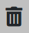

import ReactPlayer from 'react-player'

El acceso se identifica con el ícono de una **Campana** .

En este módulo podremos ver **[Notificaciones](./Notificaciones.md/#notificaciones)** actuales y su  **[Historial](./Notificaciones.md/#historial)**.
## **Notificaciones**
 Aquí podremos ver: **[Avisos de Vencimiento](./Notificaciones.md/#avisos-de-vencimiento)** y **[Nuevos Pedidos](./Notificaciones.md/#nuevos-pedidos)**.
 
### Avisos de vencimiento

:::tip NOTIFICACIONES

 Las verificaciones de las fechas de vencimiento son según los siguientes períodos de tiempo:
  - 1° Aviso: 1 año a vencerse
  - 2° Aviso: cada 3 meses del 1° aviso.
  - 3° Aviso: dentro del último mes de vencimiento.
:::
### Nuevos Pedidos
       
<ReactPlayer controls url='https://youtu.be/x9V4eCkF62E'/>

## **Historial**

Cuando una **Notificación** es visualizada, dejará de estar pendiente y se podrá observar en esta sección.

:::tip Eliminar Historial

El historial de notificaciones que ya fueron visualizadas, se puede limpiar haciendo click en el simbolo de la papelera  .

:::

<ReactPlayer controls url='https://youtu.be/tWTnKox1ACU'/>
