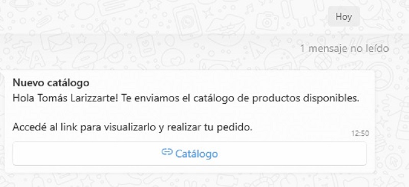

import ReactPlayer from 'react-player'

Aquí vamos a explicar la gestión de los pedidos desde 2 puntos de vista:

- Realizar pedidos siendo un **[Cliente](./Pedidos.md/#realizar-pedidos-siendo-un-cliente)**
- Realizar pedidos siendo **[Distribuidora Central](./Pedidos.md/#realizar-pedidos-siendo-distribuidora-central)**

## Realizar Pedidos siendo un Cliente

Cuando se envía un catálogo, el cliente recibe un mensaje de **Whatsapp** con un enlace **(link)** al Catálogo generado. 



Todos aquellos clientes que hayan recibido el  mensaje de **Whatsapp**, podrán realizar un Pedido como se muestra a continuación:

<ReactPlayer controls url='https://youtu.be/iEd_Egslvt0'/>
-

:::tip enviar instructivo
Podrás enviar a tu cliente el siguiente instructivo sobre cómo realizar un pedido.

El siguiente enlace se encuentra disponible en Youtube las 24hs, los 365 días del año.
```bash 
https://youtu.be/iEd_Egslvt0
```
:::

## Realizar Pedidos siendo Distribuidora Central

Todos los pedidos se presupuestan, y una vez confirmados por los Clientes, se genera su Remito correspondiente, el cual se adjuntará en la entrega de los productos.

Existen 2 tipos de pedidos a Presupuestar:
- **[Pedidos generados por los Clientes](./Pedidos.md/#presupuestar-pedido-generado-por-un-cliente)**
- **[Pedidos generados manualmente](./Pedidos.md/#presupuestar-pedido-generado-por-distribuidora-central)**

:::tip CIRCUITO: Pedido → Presupuesto → Confirmación → Remito → Entrega.

 Luego de recibir el Pedido, se genera un Presupuesto. Al confirmar
 el Presupuesto del Pedido de productos disponibles, se genera un Remito. 
 El remito se adjunta con la entrega de  los productos.

:::
### Presupuestar pedido generado por un Cliente

Luego de que el Cliente realiza un Pedido desde un Catálogo enviado, podremos realizar el Prespuesto del mismo. 

En este ejemplo se presupuesta y se genera el remito del **Pedido Pendiente #10**.

:::danger Anular

Es posible anular en cualquier momento Presupuestos o Remitos creados. 
Esto sucede cuando el Cliente cancela el Pedido que aún **no fué entregado**.

:::

<ReactPlayer controls url='https://youtu.be/SpkcowDtrlk'/>

 ### Presupuestar pedido generado por Distribuidora Central

Es posible generar Presupuestos manualmente, es decir; sin que se haya generado un enlace a **Catálogo de productos disponibles** vía whatsapp.

:::danger Importante
El campo Recargo/Descuento son valores porcentuales:

- **% positivos (Recargo)**: cuando se desea aumentar un % del importe.
- **% negativos (Descuento)**: cuando se desea descontar un % del importe.

```
Por ejemplo: 
              22% = aumenta un 22/100 el valor del importe
              y -22% = descuenta un 22/100 el valor del importe.

```
:::

<ReactPlayer controls url='https://youtu.be/hw4ECNqNaQ4'/>

## Acciones sobre Presupuestos

En todo Pedido que se haya presupuestado, se podrán realizar alguna de las siguientes acciones:
 - **Anular**: Esta acción cambia el estado del Presupuesto y lo inhabilita.
 - **Editar**: Esta acción sirve para modificar el Presupuesto antes de realizar cualquiera de las siguientes acciones.
 - **Confirmar**: cuando se confirma un Presupuesto, significa que el cliente aceptó el Pedido y se pasa a la instancia de preparación del mismo, esto habilita la creación del remito. **Ver [Pedidos Activos](../tutorial-basics/Pedidos.md/#pedidos-activos).** 
  En esta instancia, el pedido está ***LISTO PARA ARMAR Y ENTREGAR***.
 - **Imprimir**: el imprimir el Presupuesto genera un archivo en formato PDF, que se podrá imprimir o descargar.
 - **Enviar**: Esta acción, genera un archivo PDF y lo envía al whatsapp del Cliente que se encuentra asociado a ese Presupuesto.

Se muestran a continuación estas acciones:

<ReactPlayer controls url='https://youtu.be/BM8hRxBf8Ew'/>.

## Pedidos Activos

 Los Pedidos activos son aquellos pedidos que se encuetran confirmados y aceptados por el Cliente, cuyo remito fué generado, y que ya están listos para ser preparados y entregados. Les llamaremos **Pedidos Remitados**.
 
:::tip Remitos
 
Los pedidos Remitados son aquellos que ya poseen **remitos generados**.
:::

 Un **pedido remitado**, podrá tener alguna de las siguientes acciones:
   
   - **Anular**: Esta acción cambia el estado del Remito y lo inhabilita. El número que posee ese remito, no se reutiliza y queda registrado en la Base de Datos como **Anulado**.
   - **Ver Presupuesto**: desde esta acción redirecciona el Remito hacia el Presupuestó que lo originó. Esto permitirá *Enviar o Imprimir* el Presupuesto del Remito. Ver **[Acciones sobre Presupuestos](../tutorial-basics/Pedidos.md/#acciones-sobre-presupuestos).** 
   - **Entregar**: en esta acción, se registra la entrega del pedido al Cliente.

Se muestran a continuación estas acciones:

<ReactPlayer controls url='https://youtu.be/KcHKPqJWw-w'/>.