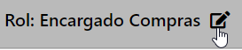

import ReactPlayer from 'react-player'

## ¿Qué es un Rol de Usuario?
Un ROL es básicamente una **plantilla de permisos** que tiene un usuario.

Tan pronto como un usuario es asignado a un rol, se le otorga acceso a determinados módulos.

:::danger IMPORTANTE
Solamente aquellos usuarios con **Rol de ADMINISTRADOR** pueden crear, eliminar y editar roles.

Además, un usuario puede ser incluido solamente en **un (1)** rol.
:::

## Agregar un nuevo Rol

Aquí creamos el nombre de un nuevo rol para luego editar sus permisos.

:::tip nota
Por defecto, al crear un nuevo Rol, NO posee permisos asociados. 

Se deberá editar el nuevo Rol para poder tener acceso a  los módulos del sistema. Ver **[Editar roles](./Roles.md/#editar-un-rol)**
:::

<ReactPlayer controls url='https://youtu.be/NPk1zneuwBo'/>

## Editar un Rol

Ahora vamos asignar los permisos de acceso de un Rol a los diferentes módulos y sus acciones asociadas.

:::tip Modificar el Nombre de un Rol

Desde esta acción también es posible modificar el nombre del Rol desde el símbolo de edición

.

:::

<ReactPlayer controls url='https://youtu.be/3D0SQWPmfEI'/>

## Eliminar un Rol

:::danger importante
Tener en cuenta que **no es posible eliminar** un "Rol" si este se encuentra **asignado** a algún usuario activo.

Para eliminar un Rol, deberá eliminarse el usuario asociado, o cambiarle el rol previamente.
:::

<ReactPlayer controls url='https://youtu.be/cTJL6Wa6a6M'/>

