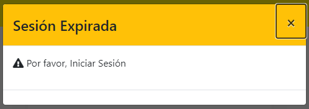

import ReactPlayer from 'react-player'

En esta sección vamos a crear usuarios que podrán **Iniciar Sesión** en **[Sistema de Soporte a Distribuidora   ](https://ssd-proyectofinal.systems/)**

:::tip administrador

Solo los usuarios que posean rol de **Administrador** podrán Agregar, Editar o eliminar usuarios.
:::

## Agregar un nuevo usuario

<ReactPlayer controls url='https://youtu.be/s96QptD8Vbs'/>

## Editar un usuario

A continuación se detallan los datos que pueden ser modificados de un usuario ya registrado.

:::danger ACTIVAR O DESACTIVAR UN USUARIO

En esta acción se podrá **activar o desactivar el acceso al sistema**, de cualquier usuario previamente registrado.

Esta acción no elimina al usuario, solo **"bloquea o habilita"** su permiso de inicio de sesión.

:::

<ReactPlayer controls url='https://youtu.be/tQGxujsmn6E'/>
-

## Eliminar un usuario

Un usuario con Rol de Administrador, podrá eliminar usuarios registrados. 

:::caution No se puede autoeliminar

Un usuario no puede autoeliminarse a sí mismo. Otro usuario Administrador deberá hacerlo.
:::

<ReactPlayer controls url='https://youtu.be/xYtALVWhfh4'/>

## Buscar un usuario

:::tip Dato de Búsqueda

La búsqueda requiere que se ingresen al menos 3 caracteres de alguno de los siguientes campos:
- Nombre
- Teléfono
- E-mail

El filtro devolverá todos aquellos elementos que cumplan con la condición.
:::

## Consideraciones de Inicio de Sesión

:::caution sesión expirada

Es importante saber que, luego de cierto tiempo logueados en el sistema sin realizar actividad alguna, la sesión **expira**. Por lo que podrá verse el siguiente mensaje:

:::

## Cambiar Contraseña

Todo usuario logueado en el sistema, podrá cambiar solo su **propia contraseña** de inicio de sesión.

:::caution requisitos de contraseña

Las contraseñas deberán cumplir con los siguientes requisitos:
- Tener más de 7 dígitos en total.
- Tener al menos una letra en mayúscula.
- Tener al menos 1 caracter numérico.
:::

<ReactPlayer controls url='https://youtu.be/5ZBne0WnllI'/>

